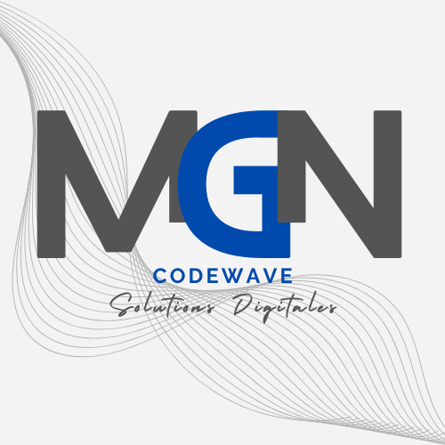

# 🌊 M.G.N CodeWave - Site Web Officiel



## 📋 Description

Site web officiel de **M.G.N CodeWave**, agence de développement web basée à Libreville, Gabon. Nous proposons des solutions digitales modernes et performantes pour transformer votre présence en ligne.

🔗 **Site en ligne** : [https://mgncodewave-com.vercel.app/](https://mgncodewave-com.vercel.app/)

🚀 **Dernière mise à jour** : Janvier 2026 - Ajout du projet Portfolio Richard

## ✨ Fonctionnalités

### Pages Principales

- 🏠 **Accueil** - Présentation de l'agence avec hero section dynamique
- 💼 **Services** - Catalogue complet des services (Sites Vitrines, E-Commerce, Blogs, Maintenance, SEO)
- 💰 **Tarifs** - Grille tarifaire transparente avec calculateur de prix interactif
- 📂 **Portfolio** - 11 projets détaillés avec études de cas
- 📝 **Blog** - 7 articles sur le développement web et le digital au Gabon
- 👥 **À Propos** - Histoire, équipe et valeurs de l'agence
- 💼 **Carrières** - 8 offres d'emploi avec système de candidature
- 📞 **Contact** - Formulaire de contact connecté à Formspree

### Fonctionnalités Techniques

- ✅ Design 100% responsive (mobile-first)
- ✅ Animations CSS personnalisées
- ✅ Barre de recherche (blog, portfolio, ressources)
- ✅ SEO optimisé avec balises meta complètes
- ✅ Performance optimisée (lazy loading, minification)
- ✅ Sécurité renforcée (CSP headers, HTTPS strict)
- ✅ Intégration YouTube avec iframes responsives
- ✅ Formulaires Formspree opérationnels
- ✅ Chat WhatsApp flottant
- ✅ Newsletter intégrée
- ✅ Cache busting automatique

## 🛠️ Technologies Utilisées

### Frontend

- **HTML5** - Structure sémantique
- **CSS3** - Styles modernes avec variables CSS
- **JavaScript (Vanilla)** - Interactions et animations
- **Font Awesome 6.4.0** - Icônes
- **Google Fonts (Inter)** - Typographie

### Hébergement & Déploiement

- **Vercel** - Hébergement et CI/CD automatique
- **GitHub** - Gestion de version
- **Git** - Contrôle de version

### Services Externes

- **Formspree** - Gestion des formulaires
- **YouTube** - Intégration vidéo
- **WhatsApp Business** - Chat en direct

## 📁 Structure du Projet

```
codewave-website-com/
├── assets/
│   ├── css/
│   │   ├── style.css           # Styles principaux
│   │   ├── responsive.css      # Media queries
│   │   └── animations.css      # Animations CSS
│   ├── js/
│   │   ├── main.js            # Scripts principaux
│   │   ├── animations.js      # Logique animations
│   │   └── portfolio.js       # Filtres portfolio
│   ├── images/
│   │   └── logo/              # Logos et assets
│   └── video/                 # Vidéos locales
├── blogs/                     # Articles de blog (7)
├── portfolio/                 # Pages détails projets (11)
├── index.html                 # Page d'accueil
├── services.html              # Page services
├── tarifs.html               # Page tarifs
├── portfolio.html            # Galerie portfolio
├── blog.html                 # Liste articles
├── a-propos.html             # À propos
├── careers.html              # Carrières
├── contact.html              # Contact
├── mentions-legales.html     # Mentions légales
├── politique-confidentialite.html
├── cgv.html                  # CGV
├── plan-du-site.html         # Sitemap HTML
├── vercel.json               # Configuration Vercel
├── sitemap.xml               # Sitemap SEO XML
├── robots.txt                # Règles robots SEO
├── package.json              # Scripts d'optimisation
├── scripts/
│   └── minify-assets.mjs     # Minification CSS/JS
├── deploy.ps1                # Script déploiement
└── README.md                 # Ce fichier
```

## 🚀 Installation & Développement Local

### Prérequis

- Git installé
- Serveur local (Live Server, Five Server, etc.)

### Étapes

```bash
# 1. Cloner le repository
git clone https://github.com/NGOUBADJAMBO-Richard/CodeWave.git
cd CodeWave

# 2. Ouvrir avec un serveur local
# Option A : VS Code avec Live Server
code .
# Clic droit sur index.html > Open with Live Server

# Option B : Five Server
# Installer Five Server extension dans VS Code
# Cliquer sur "Go Live" dans la barre de statut

# 3. Accéder au site
# http://localhost:5500 (ou port configuré)
```

## ⚡ Minification des Assets

```bash
# 1. Installer les dépendances de build
npm install

# 2. Générer les fichiers minifiés
npm run minify
```

Le script génère automatiquement :

- `assets/css/style.min.css`
- `assets/css/responsive.min.css`
- `assets/css/animations.min.css`
- `assets/js/main.min.js`
- `assets/js/animations.min.js`
- `assets/js/portfolio.min.js`

## 📦 Déploiement

### Déploiement Automatique (Recommandé)

Le site se déploie automatiquement sur Vercel à chaque push sur la branche `main`.

```bash
# 1. Faire vos modifications
git add .
git commit -m "Description des changements"
git push origin main

# 2. Vercel déploie automatiquement via webhook GitHub
# Vérifier sur : https://vercel.com/dashboard
```

### Déploiement Manuel avec Script PowerShell

```powershell
# Exécuter le script de déploiement
.\deploy.ps1

# Le script :
# - Incrémente automatiquement la version
# - Met à jour les fichiers HTML avec cache busting
# - Commit et push sur GitHub
# - Déclenche le déploiement Vercel
```

## 🔐 Configuration Vercel

Le fichier `vercel.json` configure :

### Headers de Sécurité

- `X-Frame-Options: DENY`
- `X-Content-Type-Options: nosniff`
- `X-XSS-Protection: 1; mode=block`
- `Content-Security-Policy` (permet YouTube, Google Analytics, Formspree)
- `Strict-Transport-Security`

### Cache Policy

- **Assets statiques** : 1 an (immutable)
- **HTML** : No-cache (toujours à jour)
- **Sitemap/Robots** : 24h

## 🎨 Personnalisation

### Variables CSS

Modifier les couleurs dans `assets/css/style.css` :

```css
:root {
  --primary: #667eea; /* Bleu principal */
  --secondary: #764ba2; /* Violet secondaire */
  --success: #10b981; /* Vert succès */
  --warning: #f59e0b; /* Orange warning */
  --danger: #ef4444; /* Rouge danger */
  /* ... autres variables */
}
```

### Remplacer les Vidéos YouTube

Toutes les vidéos utilisent actuellement l'ID placeholder `dQw4w9WgXcQ`.

Pour remplacer :

```bash
# Rechercher et remplacer dans tous les fichiers
# dQw4w9WgXcQ → VOTRE_VIDEO_ID
```

## 📊 Portfolio

### 11 Projets Présentés

1. **Booki** - Plateforme de réservation d'hébergements
2. **Découvre Qui Tu Es** - Tests de personnalité interactifs
3. **English Fun Club** - Apprentissage ludique de l'anglais
4. **Gestion Prospects** - CRM intelligent
5. **Grâce Déployée** - Gestion d'événements religieux
6. **H2P Group** - Portfolio développeur moderne
7. **LAMP** - Architecture technique robuste
8. **LeBonWaz** - Plateforme d'annonces gabonaise
9. **M.G.N CodeWave** - Site vitrine agence
10. **Wazup** - Application de messagerie
11. **API Airtel Money** - Documentation API interactive

## 📝 Blog

### 7 Articles Publiés

1. 10 raisons de créer un site web pour votre entreprise au Gabon
2. Optimiser le référencement SEO au Gabon
3. Les tendances web design 2025
4. Erreurs courantes des sites e-commerce
5. Vitesse de chargement et performance
6. Stratégie de contenu pour blog
7. Monétiser son site web

## 👥 Équipe

- **Richard NGOUBADJAMBO** - Project Manager & Web Developper

## 📞 Contact

- **Téléphone** : +241 66 19 89 18
- **Email** : mgncodewave18@gmail.com
- **Adresse** : Libreville, Gabon
- **WhatsApp** : [Lien direct](https://wa.me/24166198918)
- **Facebook** : [M.G.N CodeWave](https://facebook.com/mgncodewave)
- **LinkedIn** : [Profil entreprise](https://linkedin.com/company/mgn-codewave)
- **GitHub** : [NGOUBADJAMBO-Richard](https://github.com/NGOUBADJAMBO-Richard)

## 📄 Licence

© 2025 M.G.N CodeWave. Tous droits réservés.

---

**Fait avec ❤️ au Gabon par M.G.N CodeWave**
